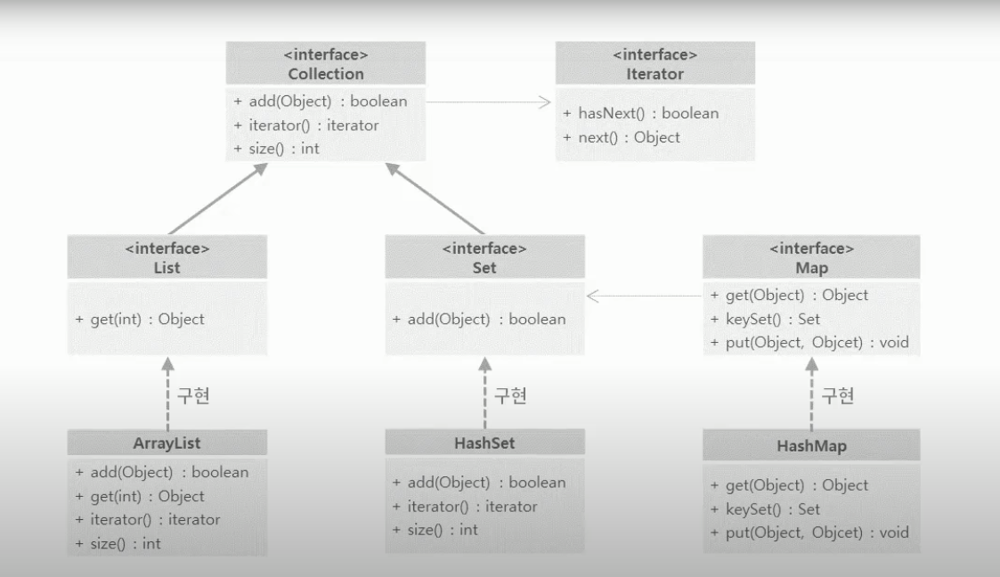

# 컬렉션 프레임워크

- java.util패키지에는 자료를 다룰 수 있는 자료구조 클래스가 다수 존재합니다. 자료구조 클래스들을 컬렉션 프레임워크라고 한다.
  - 자료구조란 자료를 저장할 수 있는 구조
  - 책을 보관하기 위해서 책장을 이용하는 것처럼 다양한 자료들을 다양한 방식으로 관리하기 위한 방법이 필요한데, 이러한 방법을 제공하는 것을 자료구조, 컬렉션 프레임워크이다.
  * 컬렉션 프레임워크에서 가장 기본이 되는 interface는 Collection인터페이스
  * Collection인터페이스는 여기에 자료가 있다라는 것을 표현.
  * 중복도 허용하고, 자료가 저장된 순서도 기억하지 못하는 것이 Collection인터페이스.
  * Collection이 가지고 있는 대표적인 메소드는 add(), size(), iterator() 메소드
  * Collection은 저장된 순서를 기억하지 못하기 때문에 "첫번째 자료를 달라, 두번째 자료를 달라"와 같은 기능을 가질 수 \* 없다. \* \* Collection은 저장된 자료를 하나씩 하나씩 꺼낼 수 있는 Iterator라는 인터페이스를 반환한다.
  * Iterator는 꺼낼것이 있는지 없는지 살펴보는 hasNext()메소드와 하나씩 자료를 꺼낼때 사용하는 next()메소드를 가지고 \* 있다.
  * Set자료구조는 중복을 허용하지 않는 자료구조를 표현하는 인터페이스
  * Collection인터페이스를 상속받는다.
  * Set인터페이스가 가지고 있는 add메소드는 같은 자료가 있으면 false, 없으면 true를 반환하는 add메소드를 가지고 있다.
  * List자료구조는 중복은 허용하면서 순서를 기억하는 자료구조를 표현.
  * Set인터페이스와 마찬가지로 Collection인터페이스를 상속받고 있다.
  * List는 순서를 기억하고 있기 때문에 0번째 1번째 n번째의 자료를 꺼낼 수 있는 get(int)메소드를 가지고 있다.
  * Map자료구조는 Key와 Value를 가지는 자료구조이다.
  * 저장할 때 put()메소드를 이용하여 key와 value를 함께 저장한다.
  * 원하는 값을 꺼낼때는 key를 매개변수로 받아들이는 get()메소드를 이용하여 값을 꺼낸다.
  * Map에 저장되어 있는 모든 Key들은 중복된 값을 가지면 안된다.
  * Key의 이런 특징 때문에 Map은 자신이 가지고 있는 모든 Key들에 대한 정보를 읽어들일 수 있는 Set을 반환하는 keySet()\* 메소드를 가지고 있다.
