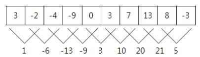

# 21. 온도의 최대값
* 매일 아침 9시에 학교에서 측정한 온도가 어떤 정수의 수열로 주어졌을 때, 연속적인 며칠 
동안의 온도의 합이 가장 큰 값을 알아보고자 한다.
예를 들어, 다음과 같이 10일 간의 온도가 주어졌을 때, 3 -2 -4 -9 0 3 7 13 8 -3 모든 
연속적인 이틀간의 온도의 합은 다음과 같다.

|:--:|

| 라운드 | 1 | 2 |3|4|5|6|7|8|9|10|
|:--:|:--:|:--:|:--:|:--:|:--:|:--:|:--:|:--:|:--:|:--:|
|A |4 |5 |6 |7 |0 |1 |2 |3 |9 |8|
|B |1 |2 |3 |4 |5 |6 |7 |8 |9 |0|
|승 |A |A |A |A |B |B |B |B |D |A|

* 아래 표의 경우에는 A와 B의 총 승점은 13점으로 같다. 마지막으로 승부가 난 라운드는 7
번째 라운드이고, 이 라운드의 승자인 B가 게임의 승자가 된다.  

| 라운드 | 1 | 2 |3|4|5|6|7|8|9|10|
|:--:|:--:|:--:|:--:|:--:|:--:|:--:|:--:|:--:|:--:|:--:|
|A |9 |1 |7 |2 |6 |3 |0 |4 |8 |5
|B |6 |3 |9 |2 |1 |0 |7 |4 |8 |5
|승 |A |B |B |D |A |A |B |D |D |D


* A와 B가 늘어놓은 카드의 숫자가 순서대로 주어질 때, 게임의 승자가 A인지 B인지, 또는 비겼
는지 결정하는 프로그램을 작성하시오.  

#### ▣ 입력설명
* 첫 번째 줄에는 A가 늘어놓은 카드의 숫자들이 빈칸을 사이에 두고 순서대로 주어진다. 두 번
째 줄에는 B가 늘어놓은 카드의 숫자들이 빈칸을 사이에 두고 순서대로 주어진다.
#### ▣ 출력설명
* 첫 번째 줄에는 게임이 끝난 후, A와 B가 받은 총 승점을 순서대로 빈칸을 사이에 두고 출력
한다. 두 번째 줄에는 이긴 사람이 A인지 B인지 결정해서, 이긴 사람을 문자 A 또는 B로 출력
한다. 만약 비기는 경우에는 문자 D를 출력한다.
#### ▣ 입력예제 1
4 5 6 7 0 1 2 3 9 8
1 2 3 4 5 6 7 8 9 0
#### ▣ 출력예제 1
16 13
A

  
  


## 내가 짠 코드
```c++
#include<iostream>
int main(){
	using namespace std;
	//freopen("input.txt", "rt", stdin);	
	int n,i;
	int a[10],b[10],aRes=0,bRes=0; //a와 b의 카드 번호를 저장하는 배열
	char winner[10];    //승부의 결과를 저장하는 배열
	
    //a와 b의 배열에 카드 번호를 저장한다.
    for(i=0;i<10;i++){
		cin>>a[i];
	}
	for(i=0;i<10;i++){
		cin>>b[i];
	}

    //a 배열의 값이 더 클 경우 3을 더해주고 각 승리자를 winner 
    //배열에 입력해준다.
	for(i=0;i<10;i++){
		if(a[i]>b[i]){
			aRes+=3;
			winner[i]='A';
		}else if(a[i]<b[i]) {
			bRes+=3;
			winner[i]='B';
		}
		else {
		aRes++; 
		bRes++; 
		winner[i]='D';
		}
	}

    //a, b의 승점을 출력해준다.
	cout<<aRes<<" "<<bRes<<"\n";
	
    //a와 b 승점을 같을시 무승부가 아닌 라운드를 찾아서 그 라운드의 ///승자를 출력해준다.
    //D 가 아닌 경우에는 winner 배열값을 반환
    //모든 라운드가 무승부인 경우에(flag가 true면) D를 출력
   	if(aRes==bRes){
		bool flag=true;
		for(i=9;i>=0;i--){
			if(winner[i]!='D') {
			 cout<<winner[i]; 
			 flag=false;
			 break;
			}
		}
		if(flag) cout<<"D";
	}else if (aRes>bRes) cout<<"A";
	 else cout<<"B";	
}
```
*
<br><br>

## 풀이
#include<iostream>
int main(){
	using namespace std;
	//freopen("input.txt", "rt", stdin);	
	int n,i;
    int a[101],b[101];
	
    //경기수 n을 입력 받는다. 
	cin>>n;
	
	//각각의 배열에 가위 바위 보를 입력 받는다. 
	for(i=0;i<n;i++){
		cin>>a[i];
	}
	for(i=0;i<n;i++){
		cin>>b[i];
	}
    
    //A가 이기는 경우만 생각해서 경우를 나눠 놓으면 else에는 B가 
    //이기는 경우만 들어간다. 
    //굉장히 간단하게 생각 가능.
    for(i=0;i<n;i++){
        if(a[i]==b[i]) cout<<"D"<<'\n';
        else if (a[i]==1 && b[i]==3) cout<<"A\n";
		else if (a[i]==2 && b[i]==1) cout<<"A\n";    
		else if (a[i]==3 && b[i]==2) cout<<"A\n";
		else cout<<"B\n";
    }
	return 0;	
}

```